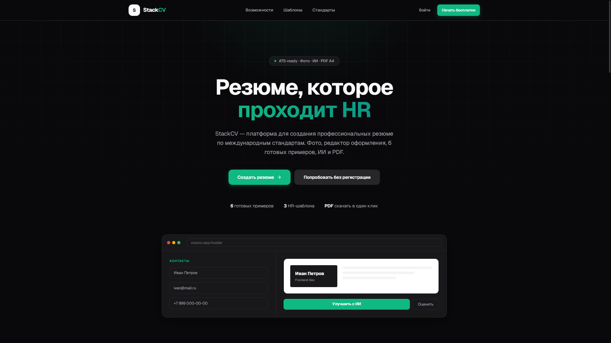
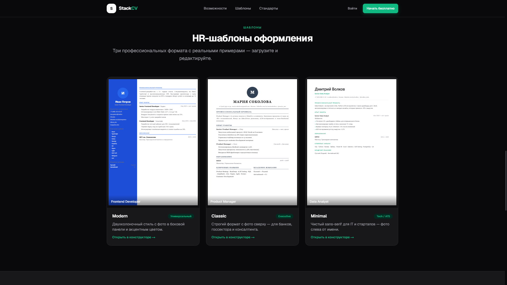
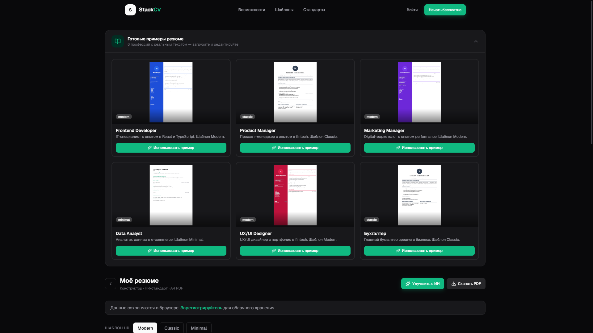
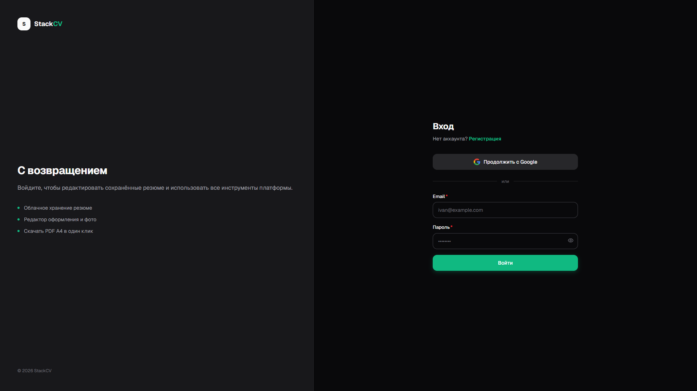

# StackCV

**AI-платформа для создания профессиональных резюме по HR-стандартам**

🌐 **Live Demo:** [https://stackcv.bakha.me](https://stackcv.bakha.me)

StackCV — полноценный веб-продукт: конструктор резюме с ИИ, редактор оформления, готовые примеры по профессиям, экспорт PDF A4, регистрация и вход через Google.

---

## Скриншоты

### Главная страница


### HR-шаблоны с реальными превью


### Конструктор резюме


### Вход через Google


---

## Возможности

| Функция | Описание |
|---------|----------|
| **ИИ-редактор** | DeepSeek переписывает «О себе» и опыт в bullet points с результатами |
| **ИИ-оценка** | Анализ разделов резюме, балл и рекомендации до отправки HR |
| **3 HR-шаблона** | Modern, Classic, Minimal — ATS-ready, формат A4 |
| **Редактор оформления** | 4 шрифта, 6 цветов, фильтры фото, позиция и форма |
| **Фото в резюме** | Загрузка, 4 фильтра, круг/скругление, режим «без фото» |
| **6 готовых примеров** | Frontend, PM, маркетинг, аналитика, дизайн, бухгалтерия |
| **PDF A4** | Скачивание файла в один клик (html2canvas + jsPDF) |
| **Авторизация** | Email/пароль + Google OAuth, облачное хранение резюме |

---

## Стек технологий

- **Frontend:** Next.js 16, React 19, TypeScript, Tailwind CSS v4, Framer Motion
- **Backend:** Next.js App Router, API Routes
- **Auth:** NextAuth.js (Credentials + Google OAuth)
- **Database:** SQLite + Prisma ORM
- **AI:** DeepSeek API (OpenAI-compatible SDK)
- **PDF:** html2canvas + jsPDF
- **Deploy:** PM2, Nginx reverse proxy, FastPanel, SSL

---

## Быстрый старт (локально)

```bash
git clone https://github.com/YOUR_USERNAME/stackcv.git
cd stackcv
npm install
cp .env.example .env.local
# Заполните DEEPSEEK_API_KEY, NEXTAUTH_SECRET, NEXTAUTH_URL

npx prisma generate
npx prisma db push
npm run dev
```

Откройте [http://localhost:3000](http://localhost:3000)

---

## Переменные окружения

См. [`.env.example`](.env.example)

| Переменная | Назначение |
|------------|------------|
| `DEEPSEEK_API_KEY` | API-ключ DeepSeek для ИИ |
| `DATABASE_URL` | Путь к SQLite (`file:./prisma/dev.db`) |
| `NEXTAUTH_SECRET` | Секрет сессии (случайная строка) |
| `NEXTAUTH_URL` | URL приложения |
| `GOOGLE_CLIENT_ID` | Google OAuth (опционально) |
| `GOOGLE_CLIENT_SECRET` | Google OAuth (опционально) |

---

## Структура проекта

```
stackcv/
├── src/
│   ├── app/              # Страницы и API routes
│   ├── components/       # UI, конструктор, шаблоны, дизайн
│   └── lib/              # AI, auth, примеры, экспорт PDF
├── prisma/               # Схема БД
├── docs/screenshots/     # Скриншоты для README
└── scripts/              # Деплой на сервер (SSH)
```

---

## Деплой

Production: **https://stackcv.bakha.me**

```bash
# На сервере через PM2 + Nginx (см. ecosystem.config.cjs)
npm run build
pm2 start ecosystem.config.cjs
```

---

## Автор

Проект разработан как **портфолио-кейс** — full-stack веб-приложение с AI, auth, PDF и production-деплоем.

---

## Лицензия

MIT
